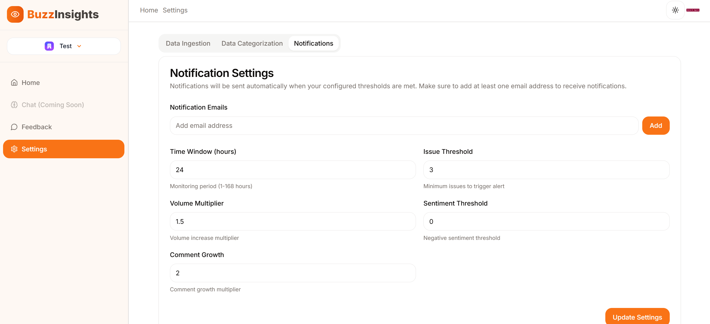

# Getting Started

Ready to turn user feedback into insights? Follow these steps to set up BuzzInsights for your team.

## 1. Create an Account

Start by [signing up for BuzzInsights](#). You can choose to:

- Use a **personal account**, or
- Use an **organizational account** if you're working with a team.

> 

## 2. Set Up Your Workspace

Once you're in:

- Choose to proceed with your **personal workspace** or **create an organization** to collaborate with others.  
  If you already have an organization, you can invite team members and assign them roles.
- Assign roles:
  - **Admins** can configure settings like ingestion schedules, feedback categories, and notification preferences.
  - **Members** can monitor feedback and receive notifications but cannot change configurations.

>   

## 3. Configure Feedback Monitoring

Set up what kind of Reddit feedback you want to monitor:

- **Choose subreddits and keywords** relevant to your product or niche.
- **Set an ingestion schedule** based on your needs:
  - **Shorter intervals** (e.g., every hour) are ideal for teams that need real-time updates or monitor high-traffic subreddits.
  - **Longer intervals** (e.g., every few hours or daily) work well for lower-volume subreddits or when real-time insights aren't critical.

> 

## 4. Define Feedback & Product Categories

Create custom categories to help BuzzInsights sort and filter your feedback:

- **Feedback Categories:** Define common topics users mention (e.g., _Bluetooth issues_).
- **Product Categories:** Use this for teams monitoring feedback across multiple products (e.g., _MacBook Pro 2020_).

> These categories help the system group feedback more accurately and also act as filters in dashboards and the feedback explorer.

**Tip:** Be as descriptive as possible—this helps the AI models categorize feedback more precisely.

> 

## 5. Set Up Notifications

Stay ahead of critical issues by configuring alerts and notifications:

- **Add recipient emails** for alert delivery.
- **Set up notification triggers**:
  - `Time Window`: Compare current activity with a past window and trigger alerts if there's a spike.
  - `Monitoring Period`: Schedule periodic feedback reports.
  - `Issue Threshold`: Alert when X number of users mention the same issue.
  - `Volume Multiplier`: Trigger when feedback volume exceeds your defined multiplier.
  - `Volume Increase Multiplier`: Alert when volume increases over time.
  - `Sentiment Threshold`: Detect shifts toward negative sentiment (scale of 0–4).
  - `Comment Growth`: Monitor spikes in engagement or replies.

> 

## 6. Start Monitoring

Once setup is complete:

- **Trigger feedback ingestion and categorization.**
- If at least one email is configured, **notifications will begin automatically**.
- If no custom thresholds are set, BuzzInsights will use **default system values** to start alerting.
